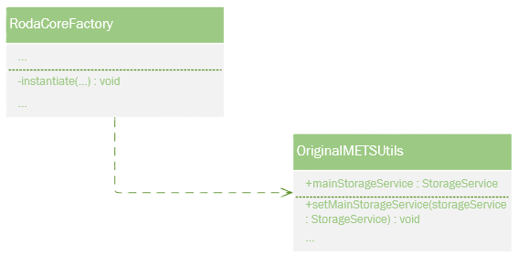
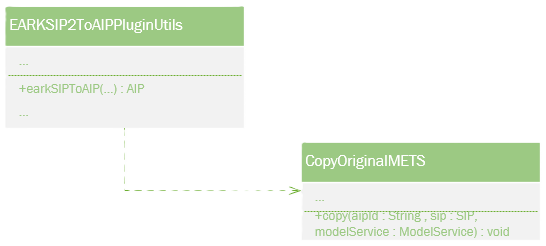
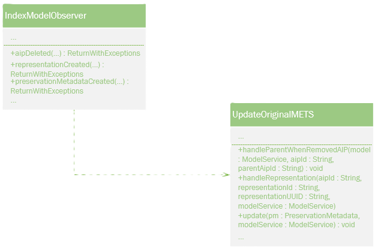

# **Original-METS**

> **⚠️ Under utveckling**
> Denna funktion är under aktiv utveckling och kan komma att förändras. Betrakta inte denna dokumentation som slutgiltig.

## **Funktionalitet**

  - När man skapar en logisk AIP kommer även en METS fil att skapas.
  - När man läser in en SIP kommer AIP:en att behålla original METS (filen/filerna) från SIP:en.
  - I de inlästa METS filerna uppdateras en del attribut så de stämmer enligt DILCIS Board.
  - Vid varje arkivvårdsarbete skapas en PREMIS fil, och den filen dokumenteras i den relaterade METS filen.
  - När man läser in en AIP samt flyttar den kommer de närmsta relationerna att dokumenteras i METS filerna, både för förälder och barn.


## **Systemöversikt**

### Original-METS måste känna till main-storage-path.



### När en logisk AIP skapas då skapas också en METS.


### När en SIP är importerad då importeras också METS.



### PREMIS processer fångas upp och dokumenteras i den relaterade METS filen.



## **Aktivera**

För att använda original-METS funktionen lägger man till egenskapen

```javaproperties
core.plugins.base.keep_original_mets = true
```

samt anger ETERNA:s version 

```javaproperties
core.plugins.base.keep_original_mets.software_version = <eterna-version>
```

i ETERNA:s konfigurationsfil, `roda-core.properties`
