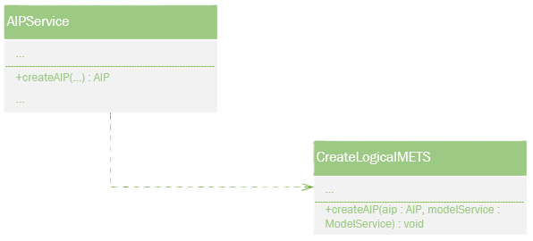

# **Original-METS**

## **Funktionalitet**
  - När man skapar en logisk AIP kommer även en METS fil att skapas.
  - När man läser in en SIP kommer AIP:en att behålla original METS (filen/filerna) från SIP:en.
  - I de inlästa METS filerna uppdateras en del attribut så de stämmer enligt DILCIS Board.
  - Vid varje arkivvårdsarbete skapas en PREMIS fil, och den filen dokumenteras i den relaterade METS filen.
  - När man läser in en AIP samt flyttar den kommer de närmsta relationerna att dokumenteras i METS filerna, både för förälder och barn.

## **Systemöversikt**

#### Original-METS måste känna till main-storage-path.

#### När en logisk AIP skapas då skapas också en METS.

#### När en SIP är importerad då importeras också METS.

#### PREMIS processer fångas upp och dokumenteras i den relaterade METS filen.

